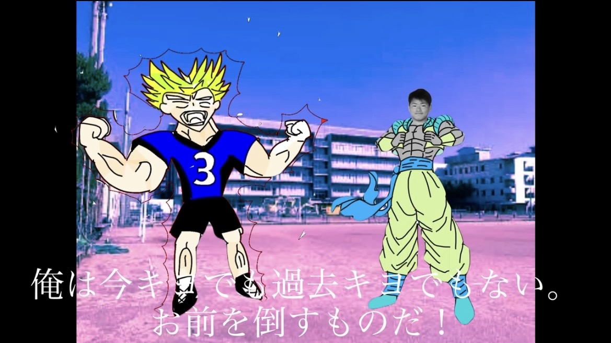

<!DOCTYPE html>
<html lang="ja">
<head>
  <meta charset="UTF-8">
  <title>凱友伝 旧二.五章</title>
  
</head>
<body>
  <h1>凱友伝 旧二.五章</h1>

  <!-- 各話のリンク（必要に応じて追加していく） -->
  <a href="https://nmi-creators.github.io/GUD_2.5_1-/" class="episode-link">
    
    旧二.五章 一話
  </a>

  <a href="𓏸𓏸話ページへのリンク" class="episode-link">
    
    旧二.五章 二話
  </a>
  
  <a href="𓏸𓏸話ページへのリンク" class="episode-link">
    
    旧二.五章 三話
  </a>

  <a href="𓏸𓏸話ページへのリンク" class="episode-link">
    
    旧二.五章 四話
  </a>

  <a href="𓏸𓏸話ページへのリンク" class="episode-link">
    
    旧二.五章 五話
  </a>

  <a href="𓏸𓏸話ページへのリンク" class="episode-link">
    
    旧二.五章 六話
  </a>

  <a href="𓏸𓏸話ページへのリンク" class="episode-link">
    
    旧二.五章 七話
  </a>

  <a href="𓏸𓏸話ページへのリンク" class="episode-link">
    
    旧二.五章 八話
  </a>
  
  <!-- 以下、話数が増えるごとにコピペで追加 -->
</body>
</html>
